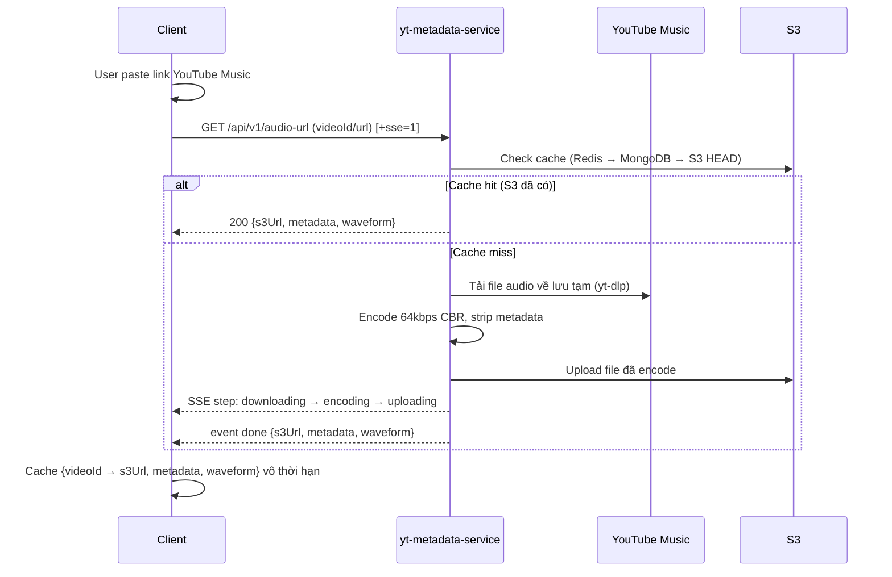
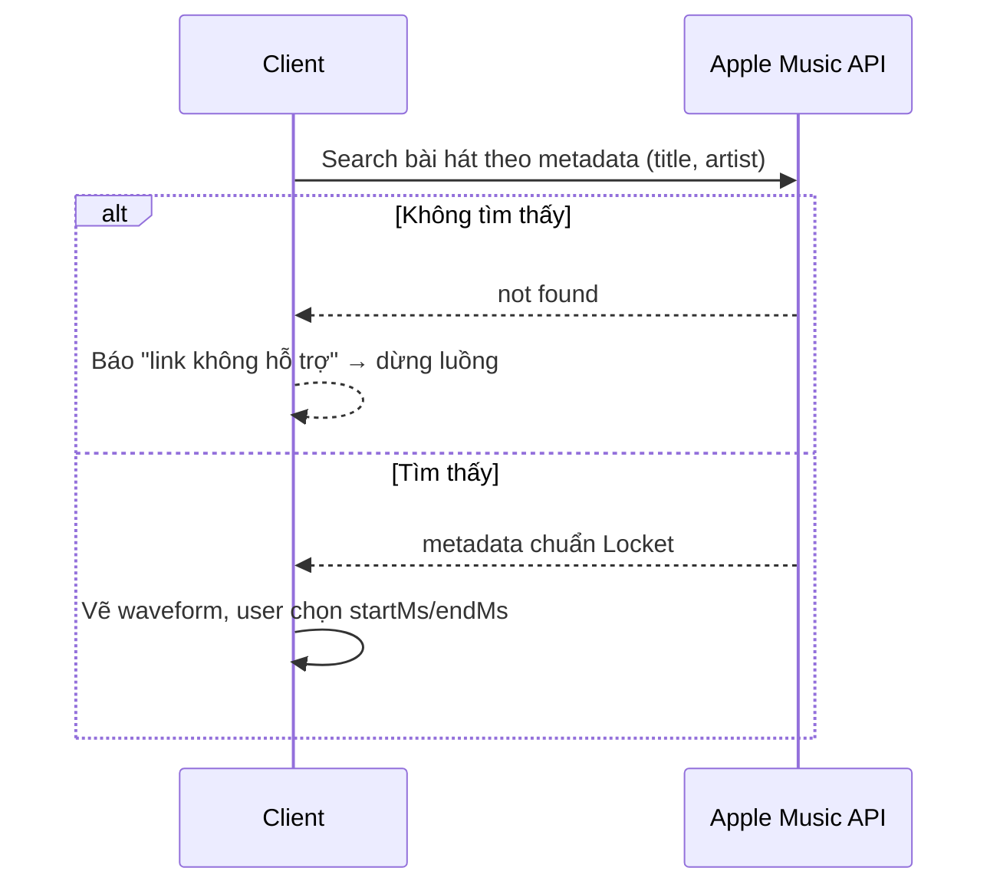
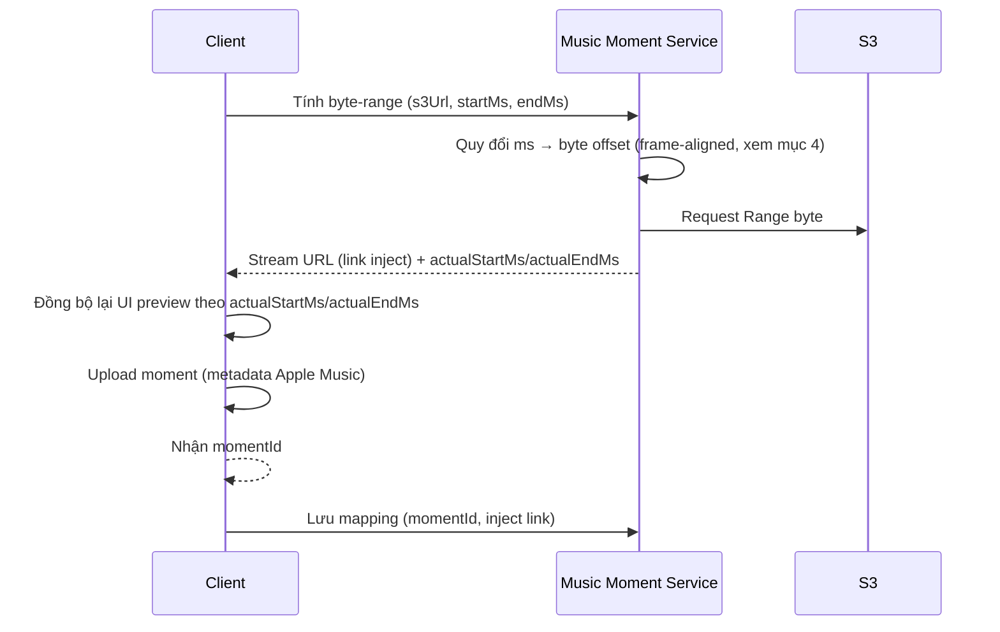
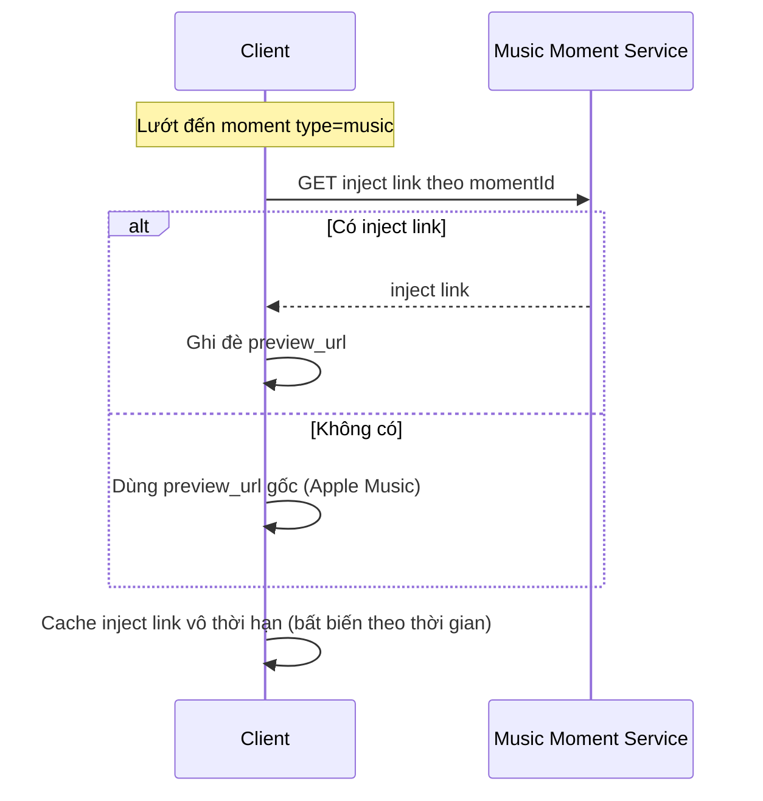

# Music Injection Flow — Tài liệu kỹ thuật

> Tính năng cho phép người dùng chèn (inject) một đoạn nhạc tùy chỉnh làm `preview_url` cho moment loại nhạc, thay thế preview mặc định từ Apple Music. **Chỉ hoạt động trên client custom này**, không phải tính năng chính thức của Locket.

## 1. Thành phần hệ thống

| Thành phần | Vai trò |
|---|---|
| **Client** (React Native) | Điều phối toàn bộ luồng, trim audio, upload moment |
| **yt-metadata-service** | Service có sẵn. Nhận link/id YouTube Music → tải, nén 64kbps CBR, strip metadata, upload S3, trả metadata + waveform. API chi tiết: mục 2 |
| **Music Moment Service** | Service tự viết (public source). Tính byte-range chính xác theo thời gian trim (ms), lưu mapping `momentId → inject link`, trả stream |

**Auth:** Cả 2 service dùng chung cơ chế `x-api-key` header (mỗi service cấp/validate key riêng).

## 2. yt-metadata-service — API tóm tắt

> Tài liệu đầy đủ (code mẫu RN/Web, SSE, checklist tích hợp): xem file `youtube-music-integration.md` đi kèm. Phần dưới chỉ tóm tắt phần liên quan đến flow inject.

- **Base URL:** `https://lockut.quockhanh020924.id.vn`
- **Endpoint:** `GET /api/v1/audio-url?videoId=<id>` (hoặc `?url=<yt music url>`)
- **Header:** `x-api-key: <SERVICE_API_KEY>`
- **Response chính:**

```json
{
  "videoId": "RKvRLLQtDbg",
  "title": "Lạc Trôi",
  "artist": "Sơn Tùng M-TP",
  "thumbnail": "https://i.ytimg.com/vi/RKvRLLQtDbg/hqdefault.jpg",
  "durationMs": 232888,
  "s3Url": "https://s3.example.com/locket-music/songs/RKvRLLQtDbg/01d0fe8baeac.mp3",
  "waveform": [0.02, 0.11, 0.47]
}
```

- **Idempotent & ổn định vĩnh viễn:** S3 key chỉ phụ thuộc `videoId` (`songs/<videoId>/<sha1(videoId)[0..12]>.mp3`) → client **cache vô thời hạn** theo `videoId` (không cần gọi lại trừ khi muốn lấy `waveform` backfill).
- **SSE (`?sse=1`)**: khuyến nghị dùng cho cold resolve (10–30s lần đầu). HTTP status luôn `200`, lỗi nằm trong event `error` — client bắt buộc phải lắng nghe event này thay vì chỉ check status.
- **MP3 trả về là nguyên bài, không cắt sẵn** — trim là trách nhiệm phía client/Music Moment Service (xem mục 3.3, 4).

### Mã lỗi

| Status | Khi nào |
|---|---|
| 400 | url/videoId không hợp lệ |
| 401 | sai/thiếu `x-api-key` |
| 413 | video dài hơn 15 phút |
| 415 | video không có stream audio |
| 500 | lỗi cấu hình/nội bộ service |
| 502 | yt-dlp / ffmpeg / S3 PUT lỗi |

## 3. Luồng chi tiết

### 3.1 Bước 1-2 — Nhập link & resolve audio (yt-metadata-service)



- Client gọi `GET /api/v1/audio-url` với `videoId`/`url`.
- Service check cache (Redis → MongoDB → S3 HEAD). Cache miss thì tải file về lưu tạm, encode 64kbps CBR + strip metadata, rồi upload lên S3.
- Trả `metadata + s3Url + waveform`.
- Client cache kết quả theo `videoId` (xem mục 2).

### 3.2 Bước 3-3.1 — Match Apple Music & trim



- Client dùng metadata (tên bài, nghệ sĩ) gọi Apple Music Search API.
- **Không tìm thấy** → báo lỗi "link không hỗ trợ", dừng luồng.
- **Tìm thấy** → nhận metadata chuẩn Locket, dùng để upload moment ở bước 5.
- Vẽ waveform từ field `waveform` (200 peak) của yt-metadata-service, người dùng chọn `startMs`/`endMs`.

### 3.3 Bước 4-5 — Tính byte-range & upload moment



- Client gọi Music Moment Service: `s3Url`, `startMs`, `endMs`.
- Service quy đổi mốc thời gian (ms) → byte offset dựa trên thông số CBR 64kbps cố định (công thức ở mục 4), tạo header `Range: bytes=<start>-<end>`.
- Service request S3 với range đó, trả về dạng **stream** — đây là link dùng để inject. Response kèm `actualStartMs/actualEndMs` (mốc đã snap theo frame) để client đồng bộ lại UI preview nếu cần.
- Client upload moment với metadata Apple Music, nhận `momentId`, gọi Music Moment Service lưu mapping `momentId → inject link`.

### 3.4 Bước 6 — Hiển thị khi lướt moment



- Moment `type = music` → gọi Music Moment Service hỏi inject link theo `momentId`.
- **Có** → ghi đè `preview_url`. **Không có** → dùng `preview_url` gốc (Apple Music).
- Inject link bất biến theo thời gian → client cache vô thời hạn.

## 4. Chuẩn hóa MP3 CBR 64kbps & công thức tính byte-range

Vì file từ yt-metadata-service luôn là **MP3 64kbps CBR, 44.100Hz**, có thể tính byte offset chính xác từ mốc thời gian mà không cần decode file.

| Tham số | Giá trị | Ý nghĩa |
|---|---|---|
| Bitrate | 64.000 bps (64 kbps CBR) | tương đương 8.000 bytes/giây |
| Sample Rate | 44.100 Hz | tần số lấy mẫu chuẩn |
| Samples per Frame | 1.152 samples | số mẫu/frame của MPEG-1 Layer III |
| Frame Duration | ≈ 26,12245 ms | `1.152 / 44.100` giây |
| Average Frame Size | ≈ 208,97959 bytes | `8000 bytes/s × 26,12245ms` |

File encode theo chuẩn này: **không ID3, không bit reservoir**.

**Xing/Info frame offset:** ffmpeg luôn ghi 1 frame Xing/Info ở đầu file (chứa số frame của *cả bài gốc*). Nếu tính byte mà không bỏ qua frame này, client nhận stream đã cắt nhưng frame Xing/Info bên trong vẫn khai báo duration của cả bài → player (vd Chrome) đọc sai duration khi phát. Vì vậy **mọi offset đều phải cộng thêm 1 frame** (`XING_FRAME_OFFSET = 1`) trước khi quy ra byte.

**Công thức quy đổi `ms → byte offset` (frame-aligned):**

```
startFrame = max(0, floor(startMs / 26.12245))
endFrame   = max(startFrame + 1, ceil(endMs / 26.12245))

startByte  = floor((startFrame + 1) * 208.97959)              // +1 = bỏ qua Xing frame
endByte    = floor((endFrame + 1) * 208.97959) - 1             // inclusive, trước byte đầu frame kế tiếp

actualStartMs = round(startFrame * 26.12245)   // mốc ms đã "snap" theo frame, KHÔNG cộng Xing offset
actualEndMs   = round(endFrame * 26.12245)
```

→ `Range: bytes=<startByte>-<endByte>`.

Lưu ý khác với bản tính đơn giản ban đầu:
- **`start` dùng `floor`, `end` dùng `ceil`** — đảm bảo đoạn cắt không bị hụt mất phần cuối (thà dư vài chục ms còn hơn thiếu).
- **Ép tối thiểu `endFrame ≥ startFrame + 1`** — tránh range rỗng/âm khi `startMs` và `endMs` quá gần nhau.
- **`actualStartMs`/`actualEndMs`**: mốc thời gian thực tế sau khi snap theo frame, trả về cho client để đồng bộ lại UI preview (mốc user chọn trên waveform có thể lệch vài chục ms so với mốc byte thực tế được cắt).

**Vì sao phải align theo frame** (không dùng `ms × 8000 / 1000` đơn thuần): bắt đầu đọc giữa frame MPEG sẽ khiến decoder không tìm được frame header hợp lệ ở byte đầu, gây lỗi/click khi phát.

**Edge case cần xử lý ở Music Moment Service:**
- `endByte` vượt quá dung lượng file thật (do `durationMs` ở metadata là ước lượng) → clamp về `Content-Length` lấy từ S3 HEAD.
- `endMs ≤ startMs` quá sát nhau → đã có ràng buộc `endFrame ≥ startFrame + 1` để không ra range rỗng/âm, nhưng vẫn nên validate input `endMs > startMs` ở tầng API trước khi tính.

## 5. Lưu trữ & hạ tầng

- **yt-metadata-service**: Redis (TTL 1 ngày) → MongoDB → S3 HEAD → tải mới nếu cache miss. Redis chết không làm fail request (service hiện có, không cần triển khai lại).
- **Music Moment Service**: tự viết, public source. DB: MongoDB Atlas (mapping `momentId → inject link`). Cache: Redis.
- Music Moment Service không lưu/transcode file nhạc, chỉ tính toán byte-range → tải nhẹ.

## 6. Error handling

| Case | Xử lý |
|---|---|
| Link YouTube Music không hợp lệ | yt-metadata-service trả `400`, client báo lỗi ngay, không gọi tiếp |
| Video > 15 phút | yt-metadata-service trả `413` |
| Video không có audio | yt-metadata-service trả `415` |
| yt-metadata-service lỗi nội bộ/transcode | `500`/`502`, client cho thử lại |
| Sai/thiếu API key | `401` ở service tương ứng |
| Không tìm thấy bài hát trên Apple Music | Báo "link không hỗ trợ", dừng luồng trước khi upload moment |
| Music Moment Service: `endMs` vượt dung lượng file | Clamp theo `Content-Length` thật từ S3 (mục 4) |
| SSE: event `error` | Bắt buộc lắng nghe, vì HTTP status luôn `200` |

## 7. Ghi chú triển khai

- Bitrate 64kbps CBR cố định cho toàn bộ pipeline (yt-metadata-service lẫn tính byte-range) — không cấu hình theo request.
- Metadata gốc trong file mp3 bị loại bỏ hoàn toàn trước khi lưu S3.
- `s3Url` và `inject link` đều bất biến theo thời gian → cả hai đều an toàn để cache vô thời hạn ở client.
- MP3 từ yt-metadata-service là nguyên bài; mọi logic "cắt" (cả preview UI lẫn inject) đều dựa trên seek/byte-range, không cắt file vật lý ở bước này.
